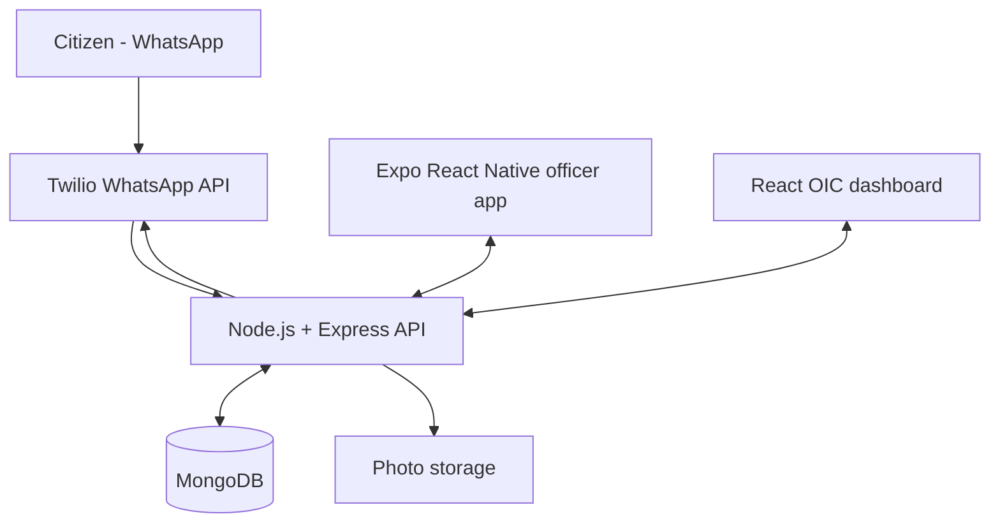

# NWSDB Water Leakage Management System

Complete academic-project implementation based on the supplied requirement, decomposition, DFD, ERD, sequence-diagram, and wireframe documents.

## Delivered applications

- `server/` - Node.js/Express REST API, MongoDB models, JWT/RBAC, Twilio WhatsApp webhook, file uploads, live Socket.IO events, PDF/CSV reports, Swagger UI, seed data, and tests.
- `web/` - React Officer-in-Charge dashboard for complaint monitoring, assignment, officer accounts, maps, analytics, PDF and CSV exports.
- `mobile-expo/` - recommended Expo React Native field-officer application for Android and iPhone, including Expo Go support, login, assigned work, navigation, GPS arrival, completion photos, and a SQLite offline queue.
- `mobile/` - original Flutter Android field-officer client retained as an alternative.
- `docs/` - step-by-step setup, API, architecture, data model, and requirements traceability.

Citizens do **not** need a dedicated application. They report a leak to the configured WhatsApp Business number using text, photograph, and/or a shared location. The Expo/Flutter applications are only for Water Board field officers.

## Architecture



## Fastest local start

Prerequisites: Node.js 22.13 or newer, npm, Docker Desktop, and Expo Go for the recommended mobile application.

1. Open a terminal in this project folder.
2. Start MongoDB:

   ```bash
   docker compose up -d mongodb
   ```

3. Configure and start the backend:

   ```bash
   cd server
   cp .env.example .env
   npm install
   npm run seed
   npm run dev
   ```

4. In a second terminal, start the web dashboard:

   ```bash
   cd web
   cp .env.example .env
   npm install
   npm run dev
   ```

5. Open `http://localhost:5173` and sign in with:

   - OIC: `oic@nwsdb.lk` / `Admin@123`
   - Officer: `officer1@nwsdb.lk` / `Officer@123`

6. For the Android/iPhone Expo app, open `mobile-expo/README.md` or follow Step 6 in `docs/STEP_BY_STEP_GUIDE.md`. Android emulators use `http://10.0.2.2:5000/api`; physical Android phones and iPhones use the development PC's LAN IP.

To start MongoDB, the API, and the production-built web dashboard together instead, set a strong `JWT_SECRET` in the terminal and run `docker compose up --build -d`. The web dashboard will be available at `http://localhost:8080`. Run the seed command inside the API container once with `docker compose exec api node src/seed.js`.

## Important URLs

| Service | URL |
| --- | --- |
| API health | `http://localhost:5000/api/health` |
| API documentation | `http://localhost:5000/api/docs` |
| React dashboard | `http://localhost:5173` |
| Twilio webhook | `https://YOUR-PUBLIC-DOMAIN/api/webhooks/twilio/whatsapp` |

## Production reminders

- Replace all example secrets and passwords.
- Use HTTPS, a restricted MongoDB user, object storage for photos, backups, and an audited deployment process.
- Set `TWILIO_VALIDATE_SIGNATURE=true` only after the public webhook URL exactly matches `TWILIO_WEBHOOK_URL`.
- The included local upload storage is appropriate for development. Use S3-compatible storage for production.

Read [STEP_BY_STEP_GUIDE.md](docs/STEP_BY_STEP_GUIDE.md) for the complete beginner-friendly procedure.

The uploaded documents contain one important scope revision and several naming/data-model differences. [DOCUMENT_DECISIONS.md](docs/DOCUMENT_DECISIONS.md) records exactly how they were reconciled, while [ARCHITECTURE_AND_TRACEABILITY.md](docs/ARCHITECTURE_AND_TRACEABILITY.md) maps the functional requirements to code.
